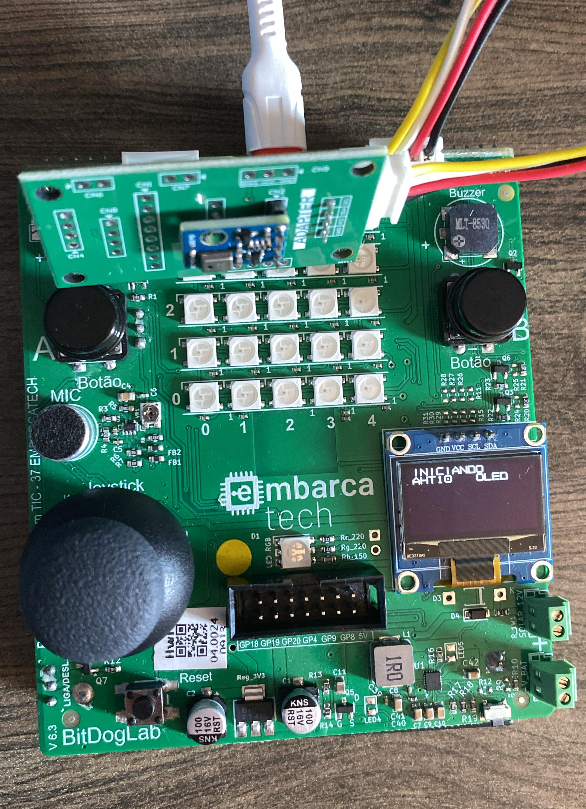

# 🌡️ Monitoramento de Temperatura e Umidade com AHT10 e Display OLED

Este projeto utiliza o microcontrolador **RP2040** (Raspberry Pi Pico), o sensor **AHT10** e um display **OLED SSD1306** para monitorar a temperatura e a umidade do ambiente em tempo real.

> ⚠️ *Como desafio adicional, o sistema pode ser expandido para exibir alertas caso a umidade ultrapasse **70%** ou a temperatura fique abaixo de **20°C**.*

---

## 📦 Componentes Utilizados

* [x] Raspberry Pi Pico (RP2040)
* [x] Sensor de Temperatura e Umidade **AHT10**
* [x] Display OLED 128x64 (controlador **SSD1306**, I2C)
* [x] BitDogLab
* [x] Biblioteca `ssd1306.h` para controle do display

---

## 📷 Demonstrações

### 🔌 Sistema em Funcionamento




---

## 🧠 Funcionalidades

* Inicializa o sensor AHT10 e o display OLED via I2C.
* Lê os valores de temperatura (°C) e umidade (%RH) a cada 3 segundos.
* Exibe as informações no display OLED.
* Apresenta mensagens de erro caso a leitura do sensor falhe.
* Possibilidade de alerta visual no display para:

  * **Umidade > 70%**
  * **Temperatura < 20°C**

---

## 🔧 Conexões

| Componente | Pico GPIO | Função   |
| ---------- | --------- | -------- |
| AHT10 SDA  | GPIO 0    | I2C0 SDA |
| AHT10 SCL  | GPIO 1    | I2C0 SCL |
| OLED SDA   | GPIO 14   | I2C1 SDA |
| OLED SCL   | GPIO 15   | I2C1 SCL |

---

## 🖥️ Saída no Serial Monitor

```
Iniciando sistema com AHT10 e OLED...
AHT10 inicializado e calibrado com sucesso.
Umidade: 55.70 %RH, Temperatura: 24.53 C
```


---

## 🧪 Possíveis Melhorias

* Implementar alerta no display caso:

  * `humidade > 70%`
  * `temperatura < 20°C`
* Salvar os dados em cartão SD (log de histórico)
* Enviar dados via comunicação serial para um PC ou outro microcontrolador

---

