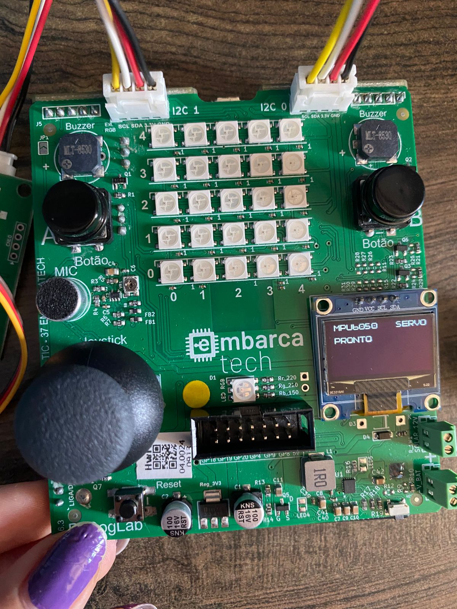
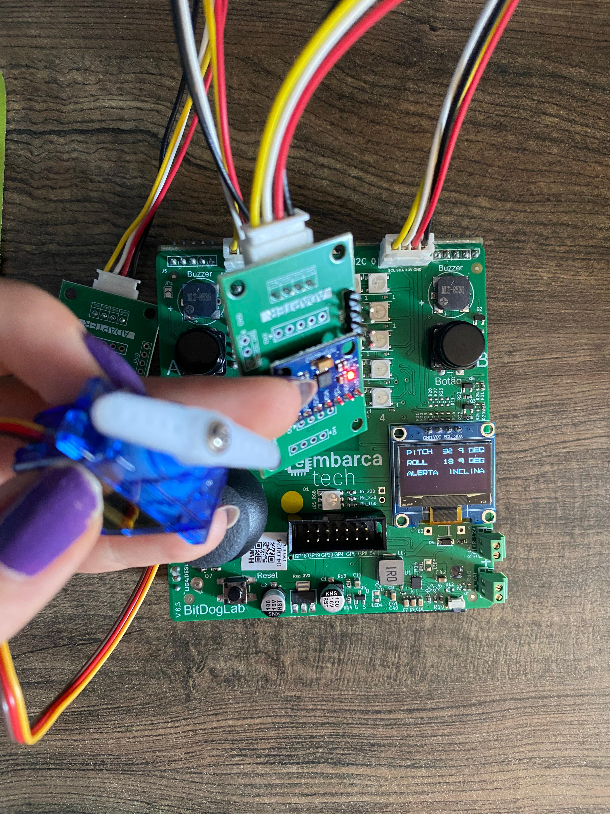

# Sistema de Monitoramento e Controle de Inclinação com RP2040

Este projeto utiliza um microcontrolador **RP2040 (Raspberry Pi Pico)** para monitorar a inclinação de um sistema físico utilizando o sensor **MPU6050** (acelerômetro e giroscópio), controlar dinamicamente um **servo motor SG90** com base na inclinação (pitch) detectada, e exibir os valores e alertas em um **display OLED SSD1306**.

## 🧠 Objetivo

- Monitorar os ângulos de **pitch** e **roll** com o MPU6050.
- Ajustar a posição de um **servo motor** proporcionalmente ao ângulo de inclinação.
- Exibir as leituras e alertas em um **display OLED**.
- Promover um **sistema de alerta visual** se os limites de inclinação forem ultrapassados.

---

## ⚙️ Hardware Utilizado

- [x] Raspberry Pi Pico (RP2040)
- [x] MPU6050 (sensor acelerômetro + giroscópio)
- [x] Servo Motor SG90 9G
- [x] BitDogLab

---

## 🔌 Conexões

### I2C0 (Sensor MPU6050)
| Sinal | Pino RP2040 | Função |
|-------|-------------|--------|
| SDA   | GP0         | I2C0 SDA |
| SCL   | GP1         | I2C0 SCL |

### I2C1 (Display OLED)
| Sinal | Pino RP2040 | Função |
|-------|-------------|--------|
| SDA   | GP14        | I2C1 SDA |
| SCL   | GP15        | I2C1 SCL |

### PWM (Servo Motor)
| Sinal     | Pino RP2040 | Função      |
|-----------|-------------|-------------|
| PWM       | GP2         | Controle PWM para o servo |

---

## 🧪 Funcionalidades

- 📐 Leitura dos ângulos de inclinação (pitch e roll) com base nos dados do acelerômetro do MPU6050.
- 🦾 Controle do servo motor com base no ângulo de pitch (de -90° a 90° mapeado para 0° a 180° do servo).
- 🖥️ Exibição contínua dos ângulos e mensagens de alerta no display OLED.
- 🚨 Geração de **alerta visual** no OLED quando a inclinação ultrapassa ±30° em qualquer eixo.

---

---

## 📷 Imagens do Projeto

A seguir, algumas imagens que ilustram o funcionamento do sistema:

| OLED Iniciando               | Inclinação 0° (servo parado)       | Inclinação com servo girando      |
|-----------------------------|------------------------------------|-----------------------------------|
|  |  |  |

---

## ▶️ Como Usar

1. Grave o arquivo `.uf2` gerado na sua Raspberry Pi Pico.
2. Conecte os periféricos de acordo com o esquema de pinos.
3. Abra um monitor serial para observar os valores de inclinação em tempo real.
4. Incline fisicamente o dispositivo para ver o servo motor reagir e os dados no OLED atualizarem.
5. Quando a inclinação ultrapassar ±30°, um **alerta visual** será exibido.

---

## 🧠 Conceitos Envolvidos

* Comunicação **I2C** com múltiplos dispositivos (MPU6050 e SSD1306).
* Conversão de dados brutos em valores físicos (g, graus).
* Controle de **servo motor via PWM**.
* Interpolação linear para mapeamento de valores.
* Manipulação de buffer e renderização em display OLED.
* **Programação embarcada** com o SDK do RP2040 em C.
